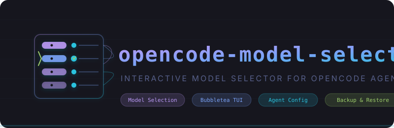

<p align="center">
  
</p>

<p align="center">
  <a href="https://github.com/lleontor705/opencode-model-selector/actions/workflows/ci.yml"></a>
  <a href="https://github.com/lleontor705/opencode-model-selector/releases/latest"></a>
  <a href="https://github.com/lleontor705/opencode-model-selector/blob/master/LICENSE"></a>
  <a href="https://goreportcard.com/report/github.com/lleontor705/opencode-model-selector"></a>
</p>

<p align="center">
  <a href="#quick-start">Installation</a> &bull;
  <a href="#features">Features</a> &bull;
  <a href="#architecture">Architecture</a> &bull;
  <a href="#contributing">Contributing</a>
</p>

---

> **opencode-model-selector** `/ˈoʊ.pən.kəʊd ˈmɒd.əl sɪˈlɛk.tə/` — A Go CLI tool for interactively selecting models and editing OpenCode agent configuration via a Bubbletea TUI.

```
┌─────────────────────────────────────────────────────────────┐
│                    opencode-model-selector                   │
├─────────────────────────────────────────────────────────────┤
│                                                              │
│  opencode models ──► Parse ──► Group by Provider             │
│                                      │                       │
│                                      ▼                       │
│  opencode.json ──► Read ──► Agent List (TUI)                │
│                                      │                       │
│                                      ▼                       │
│                    ┌─────────────────┴────────────────┐      │
│                    │                                  │      │
│                    ▼                                  ▼      │
│              Model Selection              Field Input         │
│              (fuzzy filter)               (temp/top_p/       │
│                    │                      color/steps)       │
│                    │                                  │      │
│                    └──────────────┬───────────────────┘      │
│                                   │                          │
│                                   ▼                          │
│                          Save Confirm                        │
│                          (backup → write)                    │
│                                                              │
└─────────────────────────────────────────────────────────────┘
```

## Quick Start

### Install from source

```bash
# Clone and build
git clone https://github.com/lleontor705/opencode-model-selector.git
cd opencode-model-selector
make build

# Or install directly to GOPATH/bin
go install ./cmd
```

### Prerequisites

- [OpenCode CLI](https://opencode.ai) installed and on your `$PATH`
- An `opencode.json` config file (default: `~/.config/opencode/opencode.json`)

## Features

- **Model Detection** — automatically discovers all available models from `opencode models`
- **Interactive TUI** — Bubbletea-based terminal UI with fuzzy-filter model selection
- **6 Editable Fields** — model, temperature, top_p, color, steps, and disable per agent
- **Backup & Restore** — automatic JSON backups before every write (configurable retention)
- **Cross-Platform** — single Go binary for Linux, macOS, and Windows (no runtime deps)
- **CLI Flags** — non-interactive modes for scripting: `--list-models`, `--list-agents`

## CLI Usage

```bash
# Interactive TUI (default)
opencode-model-selector

# Override config path
opencode-model-selector --config /path/to/opencode.json

# List available models grouped by provider
opencode-model-selector --list-models

# List agents with current field values
opencode-model-selector --list-agents

# Control backup retention (0 to disable)
opencode-model-selector --backup-count 10
```

| Flag | Default | Description |
|------|---------|-------------|
| `--config` | auto-detected | Override config file path |
| `--list-models` | `false` | List available models grouped by provider |
| `--list-agents` | `false` | List agents with current field values |
| `--backup-count` | `5` | Number of backups to retain (0 to disable) |

## Architecture

```
cmd/                    CLI entry point (flag parsing + dispatch)
internal/
  config/               Config loading, validation, backup, agent field access
  opencode/             OpenCode CLI detection, model retrieval, provider grouping
  tui/                  Bubbletea terminal UI (agent list, model select, field input, save)
test/                   Integration tests and test fixtures
```

### Data Flow

1. `opencode models` output is parsed into a list of `Model` structs
2. Models are grouped by provider for the selection UI
3. `opencode.json` is loaded into a `Config` struct
4. Agent list screen shows all agents with editable fields
5. Model selection provides fuzzy filtering across all providers
6. Field input allows editing temperature, top_p, color, steps, disable
7. Save confirm creates a backup, then writes the updated JSON

## Contributing

See [CONTRIBUTING.md](CONTRIBUTING.md) for the full contribution workflow, code style, and testing standards.

## License

MIT
