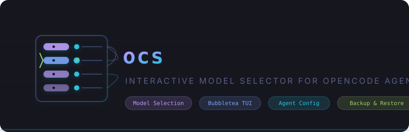

<p align="center">
  
</p>

<p align="center">
  <a href="https://github.com/lleontor705/opencode-model-selector/actions/workflows/ci.yml"></a>
  <a href="https://github.com/lleontor705/opencode-model-selector/releases/latest"></a>
  <a href="https://github.com/lleontor705/opencode-model-selector/blob/master/LICENSE"></a>
  <a href="https://goreportcard.com/report/github.com/lleontor705/opencode-model-selector"></a>
</p>

<p align="center">
  <a href="#quick-start">Quick Start</a> &bull;
  <a href="#why">Why?</a> &bull;
  <a href="#features">Features</a> &bull;
  <a href="#cli-usage">CLI Usage</a> &bull;
  <a href="#architecture">Architecture</a> &bull;
  <a href="./docs/INSTALLATION.md">Installation</a> &bull;
  <a href="./CONTRIBUTING.md">Contributing</a>
</p>

---

> **ocs** — A model selector for OpenCode's global default and agent models, with a Bubbletea TUI. It is not a generic configuration editor. (The repo/module is `opencode-model-selector`; the binary is `ocs`.)

```
┌─────────────────────────────────────────────────────────────┐
│                           ocs                                 │
├─────────────────────────────────────────────────────────────┤
│                                                              │
│  opencode models ──► Parse ──► Model Selection              │
│                                  (fuzzy filter)              │
│                                         │                    │
│  temporary loopback `opencode serve` ── GET /agent          │
│                                         │                    │
│                                         ▼                    │
│                         Runtime Agent Catalog                 │
│                         Primary / Subagent / All              │
│                                         │                    │
│                                         ▼                    │
│                          Save Model Override                  │
│                          (backup → JSON write)                │
│                                                              │
└─────────────────────────────────────────────────────────────┘
```

## Why?

Manually editing `opencode.json` to assign models to agents is error-prone. You don't know which models are available without running `opencode models` separately, and one wrong edit can corrupt the JSON or leak API keys.

| | Manual JSON Editing | ocs |
|---|:---:|:---:|
| See available models | ❌ Run `opencode models` separately | ✅ Listed in TUI with fuzzy filter |
| Model validation | ❌ No validation | ✅ Strict validation against `opencode models` |
| Safe editing | ❌ Risk of JSON corruption | ✅ Atomic writes + timestamped backups |
| API key safety | ⚠️ Easy to accidentally expose | ✅ Never logged, 0o600 perms |
| Cross-platform | ❌ Manual path resolution | ✅ Windows, macOS, Linux |
| Focused changes | ⚠️ Easy to alter unrelated settings | ✅ Writes only model assignments |

## Quick Start

```bash
# Install
go install github.com/lleontor705/opencode-model-selector/cmd/ocs@latest
# The installed binary is named `ocs`.

# Run
ocs                # interactive TUI
ocs --list-models  # list available models
ocs --list-agents  # list the agent catalog
```

**Prerequisites:** [OpenCode CLI](https://opencode.ai) on your `$PATH` for model discovery and the full runtime agent catalog; Go 1.26+ when installing from source. If runtime discovery is unavailable, agent listing falls back to the static configuration catalog with a degraded warning.

For detailed installation instructions, see [INSTALLATION.md](./docs/INSTALLATION.md).

## Features

- **Model-Only Editing** — changes only the global `model` or an `agent.<name>.model` assignment
- **Model Detection** — automatically discovers all available models from `opencode models`
- **Runtime Agent Catalog** — starts a short-lived `opencode serve` bound to loopback and reads `GET /agent`, including native, custom, and plugin-provided runtime agents while excluding hidden native agents
- **Role Sections** — presents agents as **Primary**, **Subagent**, or **All**
- **Degraded Fallback** — if runtime discovery fails (including when the OpenCode binary is missing), uses static JSON, global agent Markdown, and project agent Markdown sources and displays a degraded warning
- **Interactive TUI** — Bubbletea-based terminal UI with fuzzy-filter model selection
- **JSONC Support** — loads `opencode.json` and `opencode.jsonc` (comments and trailing commas allowed on load)
- **Backup & Restore** — automatic JSON backups before every write (configurable retention)
- **Cross-Platform** — single Go binary for Linux, macOS, and Windows
- **CLI Flags** — non-interactive modes for scripting: `--list-models`, `--list-agents`

> **Configuration writes:** `ocs` writes only the top-level `model` or `agent.<name>.model` to JSON/JSONC. Agent Markdown files are discovery inputs and remain immutable. JSONC comments are supported on load but are not preserved on save because the file is rewritten as standard JSON.

> **Startup:** runtime discovery starts a temporary local OpenCode server, so startup typically takes a few seconds; observed startup varies (~2-5s). The server accepts only a validated loopback address and is stopped after discovery. On Windows, descendant cleanup is best effort using the current `taskkill /T /F` implementation; this is not a strict child-containment guarantee.

## CLI Usage

```bash
# Interactive TUI (default)
ocs

# Override config path (opencode.json or opencode.jsonc)
ocs --config /path/to/opencode.json

# List available models grouped by provider
ocs --list-models

# List the runtime agent catalog
ocs --list-agents

# Control backup retention (0 to disable)
ocs --backup-count 10
```

| Flag | Default | Description |
|------|---------|-------------|
| `--config` | auto-detected | Override config file path |
| `--list-models` | `false` | List available models grouped by provider |
| `--list-agents` | `false` | List the agent catalog with name, mode, model, and status columns |
| `--backup-count` | `5` | Number of backups to retain (0 to disable) |

## Documentation

| Document | Description |
|----------|-------------|
| [Installation](./docs/INSTALLATION.md) | Multi-platform installation guide |
| [Contributing](./CONTRIBUTING.md) | Issue-first workflow, conventions, labels |
| [Changelog](./CHANGELOG.md) | Release history |
| [License](./LICENSE) | MIT License |

## Architecture

```
main.go                 CLI entry point (flag parsing + dispatch)
internal/
  agentcatalog/         Runtime catalog classification and degraded static fallback
  config/               Config/model loading, layered resolution, backup, and writes
  opencode/             Model retrieval and temporary loopback runtime-agent probe
  tui/                  Bubbletea terminal UI (agent catalog, model selection, save)
test/                   Integration tests and test fixtures
```

### Data Flow

1. `opencode models` output is grouped by provider for model selection.
2. A short-lived loopback `opencode serve` process supplies the authoritative catalog through `GET /agent`.
3. Native, custom, and plugin runtime agents are classified into Primary, Subagent, and All; hidden native agents are excluded.
4. If that probe fails, static JSON, global Markdown, and project Markdown identities are used with a degraded warning. Effective model precedence remains JSON, then project Markdown, then global Markdown.
5. Model selection provides fuzzy filtering across all providers.
6. Save confirmation creates a backup, then writes only the global `model` or selected `agent.<name>.model` override to JSON/JSONC. Markdown files are never modified.

## Contributing

See [CONTRIBUTING.md](CONTRIBUTING.md) for the full contribution workflow, code style, and testing standards.

## License

MIT

---

<p align="center">
  Built with <a href="https://charm.sh/">Bubbletea</a> &bull;
  Powered by <a href="https://go.dev/">Go</a>
</p>
